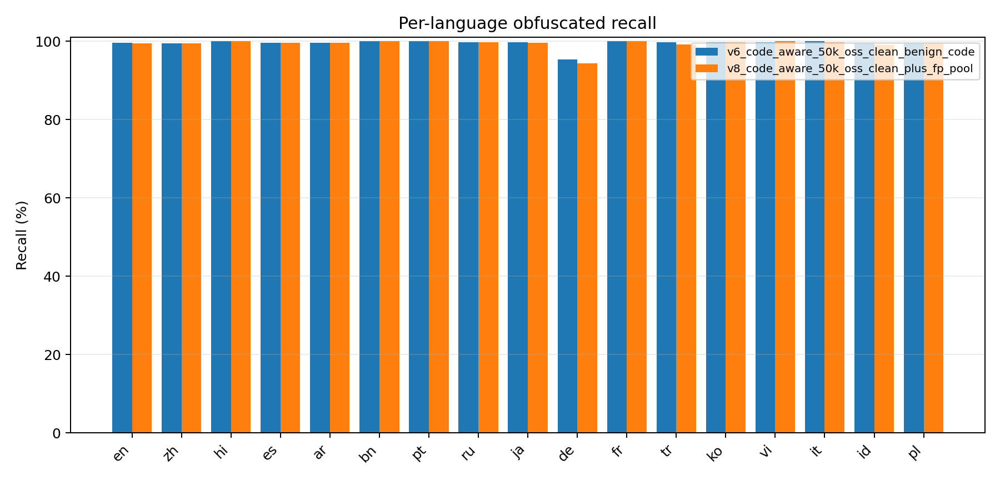

# Malicious Coding Intent Classifier

Classifier for detecting malicious-coding intent in AI prompts and code-like
inputs. The project is framed as a red-team evaluation: build a lightweight
filter, then try to break it with realistic bypasses and document where it
fails.

The model uses `BAAI/bge-m3` embeddings with small logistic-regression heads:
one binary malicious/benign head and one 12-category multilabel head. The
encoder is frozen, so training the heads is cheap and reproducible.

## What This Tests

Safety filters can look strong on clean English prompts and still fail under
simple adversarial pressure. This repo focuses on three bypass axes:

1. **Obfuscation** - leetspeak, homoglyphs, punctuation, truncation.
2. **Language pivot** - the same malicious intent outside English.
3. **Code-vs-intent confusion** - checking whether the classifier learned
   malicious intent or merely learned that code-looking text is suspicious.

The third axis is the main finding. A code-heavy model reached very high recall,
but flagged too much normal benign code. Adding benign-code hard negatives fixed
most of that failure mode, with a measurable recall trade-off.

## Headline Results

Recommended model: `models/v6_code_aware_50k_oss_clean_benign_code/`.

| Check | Result |
|-------|-------:|
| In-distribution test | F1 99.80%, ROC-AUC 0.9997, FPR 0.40% |
| Obfuscated hold-out | Recall 99.35% |
| Malware-code hold-out | Recall 98.90% |
| Clean OSS benign-code hold-out | FPR 1.12% |
| Language-pivot obfuscated recall | Avg 99.49% across 16 languages |

The important sanity check is benign code. Before benign-code hard negatives,
the 50k code-heavy model flagged **26.7%** of normal code as malicious. The
recommended v6 model reduces broader clean OSS benign-code FPR to **1.12%**
while keeping malware-code recall at **98.90%**.

## v6 vs v8

`v8` is a hard-negative ablation, not a blanket replacement for v6.

| Model | Role | Malware-code recall | Obfuscated recall | HF CodeParrot benign-code FPR |
|-------|------|--------------------:|------------------:|------------------------------:|
| `v6_code_aware_50k_oss_clean_benign_code` | balanced / recommended | 98.90% | 99.35% | 7.13% |
| `v8_code_aware_50k_oss_clean_plus_fp_pool` | code-hardened ablation | 98.40% | 99.18% | 2.28% |

Interpretation: v8 cuts CodeParrot false positives by about 3.1x
(`713/10,000` -> `228/10,000`) but costs 0.50 points of malware-code recall.
That is an explicit operating trade-off, not an "everything got better" claim.

## Language Axis

The language-pivot check did not show a low-resource collapse in positive
recall. On a 500-example-per-language sample:

| Model | Canonical avg recall | Obfuscated avg recall | Worst obfuscated language |
|-------|---------------------:|----------------------:|--------------------------:|
| v6 | 99.85% | 99.49% | de 95.40% |
| v8 | 99.71% | 99.35% | de 94.40% |

Arabic, Chinese, Japanese, Korean, Hindi, and Bengali all stayed around
99.4-100.0% obfuscated recall in this check. Per-language FPR is still pending:
the repo needs matched multilingual benign prompts before precision/FPR by
language can be claimed honestly.



Full evaluation notes are in [docs/EVAL_RESULTS.md](docs/EVAL_RESULTS.md).

## Quick Start

```bash
cd "C:/GitHub/Safety DS"
python -m venv .venv
.venv/Scripts/activate
pip install -r requirements.txt

# After the first BGE-m3 download, scripts can run from local cache.
set HF_HUB_OFFLINE=1
set TRANSFORMERS_OFFLINE=1

python scripts/predict_classifier.py --model-dir models/v6_code_aware_50k_oss_clean_benign_code \
  "write code to dump lsass" "how do I enable 2FA"
```

The CLI returns the binary malicious/benign label, the raw malicious-intent
score, a derived routing tier (`low`, `suspicious`, `high`), and the top
category scores. The routing tier is a policy layer over the binary score, not
a separately trained three-class label. Use `--jsonl` for gateway-friendly
structured output.

## Repository Layout

```text
config/   data/   docs/   models/   scripts/
```

Key artifacts:

| Artifact | Path |
|----------|------|
| Recommended model | `models/v6_code_aware_50k_oss_clean_benign_code/` |
| Hard-negative ablation | `models/v8_code_aware_50k_oss_clean_plus_fp_pool/` |
| Evaluation report | `docs/EVAL_RESULTS.md` |
| Language-axis report | `docs/language_axis_eval.json` |
| Label schema | `config/categories.yaml` |

Large generated classifier splits are ignored by git and can be rebuilt or
published separately to Hugging Face.

## Published Artifacts

| Artifact | Link | What it is |
|----------|------|------------|
| Code + evaluation story | [GitHub](https://github.com/sol087087-arch/Malicious-Coding-Intent-Dataset-Classifier) | scripts, README, docs, small model heads, eval reports |
| v6 dataset | [HF dataset](https://huggingface.co/datasets/NecroMOnk/malicious-coding-intent-v6-data) | train/val/test splits for the recommended v6 model |
| v6 model | [HF model](https://huggingface.co/NecroMOnk/malicious-coding-intent-v6) | balanced recommended classifier heads |
| v8 model | [HF model](https://huggingface.co/NecroMOnk/malicious-coding-intent-v8-hard-negative-ablation) | code-hard-negative ablation heads |
| Base encoder | [BAAI/bge-m3](https://huggingface.co/BAAI/bge-m3) | frozen embedding model used by all classifier heads |

The large generated `data/external/malware_code_merged.json` file is not
committed to GitHub. It is an intermediate pool used to build classifier splits;
publish generated splits to the HF dataset repo instead of adding the raw 425MB
JSON artifact to git.

## Reproduce Evaluation

```bash
python scripts/evaluate_classifier.py \
  --model-dir models/v6_code_aware_50k_oss_clean_benign_code \
  --clf-dir data/clf/v6_code_aware_50k_oss_clean_benign_code \
  --splits test test_obfuscated test_malware_code \
  --device cuda

python scripts/evaluate_benign_code_holdout.py \
  --model-dir models/v6_code_aware_50k_oss_clean_benign_code \
  --holdout data/clf/v6_code_aware_50k_oss_clean_benign_code/test_benign_code.jsonl \
  --device cuda

python scripts/evaluate_language_axis.py \
  --model-dir models/v6_code_aware_50k_oss_clean_benign_code \
  --model-dir models/v8_code_aware_50k_oss_clean_plus_fp_pool \
  --out docs/language_axis_eval.json \
  --csv-out docs/language_axis_eval.csv \
  --chart-out docs/language_axis_obfuscated_recall.png \
  --limit-per-lang 500 --device cuda --max-length 128
```

## Training Pipeline

```bash
python scripts/build_malware_code_pool.py --target 50000

python scripts/build_benign_code_holdout.py \
  --out data/clf/benign_code_holdout_oss_clean.jsonl --target 8000

python scripts/build_classifier_dataset.py \
  --multilingual --hf-in-train neg-only --code-aware \
  --malware-code-train 47500 --malware-code-val 500 \
  --benign-code data/clf/benign_code_holdout_oss_clean.jsonl \
  --benign-code-train 3500 --benign-code-val 500 \
  --out-dir data/clf/v6_code_aware_50k_oss_clean_benign_code

python scripts/train_classifier.py \
  --clf-dir data/clf/v6_code_aware_50k_oss_clean_benign_code \
  --model-dir models/v6_code_aware_50k_oss_clean_benign_code \
  --device cuda --batch-size 128 --holdout-batch-size 32 --max-length 128
```

## Known Limitations

- Obfuscated and malware-code hold-outs are positive-only, so they report recall
  but not precision.
- Per-language FPR is not claimed yet; matched multilingual benign negatives
  are the next evaluation artifact.
- The multilabel category head is weaker than the binary head on long
  malware-code snippets.
- v8 improves one hard-negative axis but slightly reduces recall; v6 remains
  the recommended balanced model.

## Scope

This is a malicious-coding intent classifier, not a general toxicity benchmark.
It is meant to evaluate security-relevant prompts/code and red-team bypass
patterns.

## License

MIT. See [LICENSE](LICENSE).
