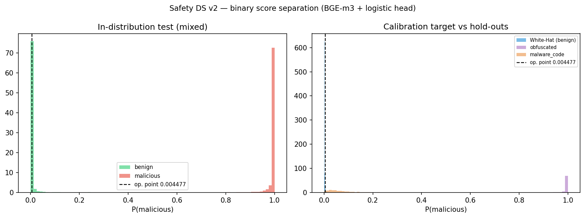

# Evaluation Results

Recommended model: `models/v6_code_aware_50k_oss_clean_benign_code/`

Earlier baselines:

- `models/v2_multilingual/` - multilingual prompt/lexicon baseline.
- `models/v3_code_aware_50k/` - code-heavy ablation, high malware-code recall
  but poor benign-code FPR.
- `models/v4_code_aware_50k_benign_code/` - first benign-code hard-negative
  run; good narrow check, weaker broader OSS generalization.

Embedder: `BAAI/bge-m3`
Primary artifacts: `metrics.json`, `benign_code_eval.json`, classifier splits
under `data/clf/v6_code_aware_50k_oss_clean_benign_code/`.

## Evaluation Frame

The model is evaluated against a red-team threat model:

1. malicious-coding requests with string obfuscation;
2. malicious-coding requests translated or generated outside English;
3. benign defensive-security prompts that look close to the malicious class;
4. benign code snippets, to test whether the head learned `code == malicious`.

The absolute decision threshold is not the main metric. Earlier v2 runs used a
low White-Hat-calibrated operating point; v3-v6 runs below use the
sklearn/default threshold (`0.5`) unless a calibration file is written.

## Current v6 Results

| Split | n | Metric |
|-------|--:|--------|
| In-distribution test | 27,736 | Precision 99.96%, recall 99.64%, F1 99.80%, ROC-AUC 0.9997, FPR 0.40% |
| Obfuscated hold-out | 4,000 | Recall 99.35% |
| Malware-code hold-out | 2,000 | Recall 98.90% |
| Clean OSS benign-code hard-negative hold-out | 4,000 | FPR 1.12% |

The benign-code result is the key sanity check. Before adding benign-code
negatives, the 50k code-heavy model reached 99.65% malware-code recall but
flagged 26.7% of benign code as malicious. The first v4 hard-negative pass
looked strong on its own narrow benign-code test (0.6% FPR), but rose to 3.35%
FPR on a broader clean OSS hold-out. The current v6 set uses quality-filtered
OSS/devops/math/security negatives and brings the broader hold-out down to
1.12% FPR while keeping malware-code recall at 98.9%.

Residual failure mode: Vesuvius-like scientific/graphics code is still noisy
(`27/360`, 7.5% FPR). That is the next targeted benign-code bucket, not a reason
to add unfiltered bulk negatives.

## Code-Heavy Ablation

| Model | Malware-code recall | Obfuscated recall | Benign-code FPR | In-dist FPR |
|-------|--------------------:|------------------:|----------------:|------------:|
| `v3_code_aware` | 98.40% | 99.42% | 17.3% | 0.24% |
| `v3_code_aware_50k` | 99.65% | 99.20% | 26.7% | 0.32% |
| `v4_code_aware_50k_benign_code` | 98.80% | 99.10% | 0.6% narrow / 3.35% broader OSS | 0.65% |
| `v5_code_aware_50k_oss_benign_code` | 98.25% | 98.72% | 0.8% narrow | 0.69% |
| `v6_code_aware_50k_oss_clean_benign_code` | 98.90% | 99.35% | 1.12% broader OSS | 0.40% |

Interpretation: near-perfect ROC-AUC on the original splits was not enough.
The classifier was partly exploiting a surface distinction between code and
natural language. Benign-code hard negatives make the evaluation harder and
the result more credible. The v5 run shows that "more negatives" is not enough:
unfiltered OSS/minified/resource-like snippets reduced malware-code recall.
The v6 run is the better quality step because it filters the benign-code pool
before training.

## Hard-Negative v8 Ablation

Hypothesis: the binary head may partially learn `code == malicious` instead of
malicious intent. To attack that blind spot, v8 adds mined benign-code false
positives from CodeParrot/OSS/GitHub-style code to the training negatives.

| Model | Role | Malware-code recall | Obfuscated recall | In-dist FPR | HF CodeParrot benign-code FPR | Clean OSS benign-code FPR |
|-------|------|--------------------:|------------------:|------------:|------------------------------:|--------------------------:|
| `v6_code_aware_50k_oss_clean_benign_code` | balanced / recommended | 98.90% | 99.35% | 0.40% | 7.13% | 1.12% |
| `v8_code_aware_50k_oss_clean_plus_fp_pool` | hard-negative ablation | 98.40% | 99.18% | 0.24% | 2.28% | 1.00% |

Interpretation: v8 is not simply "better". It cuts HF CodeParrot benign-code
false positives by about 3.1x (`713/10,000` -> `228/10,000`), but costs 0.50
points of malware-code recall and 0.17 points of obfuscated recall. Treat v6 as
the balanced model and v8 as a code-hardened operating trade-off / ablation.

Additional v8 benign-code checks at threshold `0.5`:

| Hold-out | n | FPR |
|----------|--:|----:|
| OSS clean | 8,000 | 1.00% |
| GitHub/Lora clean | 12,000 | 0.78% |
| MathTrain/Reasoner clean | 12,000 | 0.79% |
| Lora clean | 10,000 | 0.90% |

This is the red-team result: the `code == malicious` failure mode is real,
measurable, and partially mitigated, but the mitigation has a visible recall
cost. Do not train v9 on the same mined pool; the next v9 candidate needs a new
clean benign-code batch, otherwise it risks overfitting to one CodeParrot
sample.

## Language-Axis Check

Run:

```bash
python scripts/evaluate_language_axis.py \
  --model-dir models/v6_code_aware_50k_oss_clean_benign_code \
  --model-dir models/v8_code_aware_50k_oss_clean_plus_fp_pool \
  --out docs/language_axis_eval.json \
  --csv-out docs/language_axis_eval.csv \
  --chart-out docs/language_axis_obfuscated_recall.png \
  --limit-per-lang 500 --device cuda --max-length 128
```

This evaluates per-language positive recall directly from `data/<lang>/`
canonical and obfuscated sources. Historical `test_obfuscated.jsonl` files did
not preserve `lang`; `build_classifier_dataset.py` now keeps it for future
splits.

| Model | Canonical avg recall | Canonical worst | Obfuscated avg recall | Obfuscated worst |
|-------|---------------------:|----------------:|----------------------:|-----------------:|
| `v6_code_aware_50k_oss_clean_benign_code` | 99.85% | en 99.20% | 99.49% | de 95.40% |
| `v8_code_aware_50k_oss_clean_plus_fp_pool` | 99.71% | en 98.80% | 99.35% | de 94.40% |

Focused low-resource / non-Latin check:

| Model | zh obf | ar obf | ja obf | ko obf | hi obf | bn obf |
|-------|-------:|-------:|-------:|-------:|-------:|-------:|
| `v6_code_aware_50k_oss_clean_benign_code` | 99.4% | 99.6% | 99.8% | 99.8% | 100.0% | 100.0% |
| `v8_code_aware_50k_oss_clean_plus_fp_pool` | 99.4% | 99.6% | 99.6% | 99.8% | 100.0% | 100.0% |


Interpretation: the language-pivot axis does not show a low-resource collapse
in the current positive recall checks. The remaining gap is per-language FPR:
the current repository does not yet include matched multilingual benign
negative prompts, so precision/FPR by language should remain listed as pending
until that hold-out is created.

## Operating Points

| Mode | Threshold | Use |
|------|----------:|-----|
| sklearn/default | `0.5` | Baseline comparison; strong in-distribution, poor malware-code recall |
| White-Hat FPR <= 5% | `0.004477` | Recall-oriented operating point for obfuscated/malware-code screening |
| White-Hat FPR <= 1% | `0.012771` | Stricter candidate from `binary_threshold.json` |

These thresholds describe the older v2 calibrated model. Current v6 numbers
above are reported at `0.5`; recalibration is still a follow-up.

## Threshold-Independent Checks

Run:

```bash
python scripts/plot_score_dist.py --model-dir models/v2_multilingual --device auto
```

This writes:

- `models/v2_multilingual/score_distribution.json`
- `docs/score_distribution_v2.png`

The script reports ROC-AUC and PR-AUC (Average Precision) where both classes
are present. It also builds mixed checks such as White-Hat benign rows versus
obfuscated/malware-code positives, because the individual hold-out splits are
currently all-positive.

Diagnostic run produced:

```bash
python scripts/plot_score_dist.py \
  --device auto --batch-size 16 --max-length 256 \
  --max-rows-per-split 200 --white-hat-max 500
```

| Eval set | ROC-AUC | PR-AUC | Notes |
|----------|--------:|-------:|-------|
| In-distribution test | 1.000 | 1.000 | sampled; full ROC-AUC in `metrics.json` is 0.9998 |
| White-Hat vs obfuscated | 1.000 | 1.000 | sampled mixed benchmark |
| White-Hat vs malware-code | 0.858 | 0.822 | sampled mixed benchmark; this is the hard split |
| White-Hat vs all hold-out positives | 0.929 | 0.945 | sampled mixed benchmark |



This diagnostic uses the local `transformers` CLS fallback with truncation
(`max_length=256`) because the local `sentence_transformers` import currently
fails on an OpenSSL ABI issue. Treat these as fast sanity numbers, not final
paper numbers.

## Results at the White-Hat FPR <= 5% Point

| Dataset | n | Recall | FPR | Notes |
|---------|--:|-------:|----:|-------|
| White-Hat-600K | 19,960 | n/a | 4.9% | calibration target; all benign |
| Obfuscated hold-out | 4,000 | 100% | n/a | all-positive split |
| Malware-code hold-out | 4,000 | 98.6% | n/a | all-positive split |
| all_external HF | 24,127 | 79.7% | 7.4% | mixed external import |

These recall values are useful stress checks, but they are not complete model
quality claims because the two core hold-outs do not yet contain negatives.

## Default Threshold Comparison

From `models/v2_multilingual/metrics.json` after retraining with HF benign
negatives:

| Split | Recall | FPR |
|-------|-------:|----:|
| test | 99.65% | 0.61% |
| test_obfuscated | 99.42% | n/a |
| test_malware_code | 0.43% | n/a |

This is the important failure mode: the default boundary performs well on the
standard mixed test but misses almost all real malware-code hold-out snippets.

## Known Failure Modes

- **All-positive obfuscated/malware-code hold-outs** - these need matched
  benign negatives, ideally per language, before precision/F1 can be claimed.
- **Compressed scores** - the chosen operating point is low. Use ROC/PR-AUC and
  score histograms to justify any threshold.
- **Benign-code generalization** - v6 improves broader clean OSS FPR, but
  scientific/graphics/minified-looking code still produces false positives.
- **Multilabel hold-out quality** - binary scoring is much stronger than the
  category head on long malware-code snippets.

## Next Evaluation Step

Add matched multilingual benign negatives. The positive language-pivot check
now shows high recall, but precision/FPR by language still needs benign prompts
in the same languages before it can be claimed.

For the next model candidate, broaden benign-code sources with a new clean
batch rather than reusing the same mined CodeParrot false positives.

## Hard-Negative Mining

Do not add broad benign-code dumps directly to train. Mine false positives from
the current recommended model, filter noisy/minified/vendor-like chunks, and
append only curated hard negatives to the pool:

```bash
python scripts/mine_benign_code_false_positives.py \
  --model-dir models/v6_code_aware_50k_oss_clean_benign_code \
  --holdout data/clf/benign_code_holdout_github_lora_clean.jsonl \
  --out data/clf/benign_code_fp_mined_v6_github_lora_thr035.jsonl \
  --device cuda --batch-size 32 --max-length 128 \
  --threshold 0.35 --max-total 500 --max-per-source 120

python scripts/append_benign_code_fp_pool.py \
  --input data/clf/benign_code_fp_mined_v6_github_lora_thr035.jsonl \
  --pool data/clf/benign_code_fp_curated_pool.jsonl --backup
```

The HF code pull is intentionally streaming / paginated, not a full dataset
download:

```bash
python scripts/import_hf_benign_code.py --backend rows-api \
  --out data/external/hf_benign_code_codeparrot_clean_project_10k.jsonl \
  --target 10000 --max-per-dataset 10000 --request-sleep 1.0

python scripts/evaluate_benign_code_holdout.py \
  --model-dir models/v6_code_aware_50k_oss_clean_benign_code \
  --holdout data/external/hf_benign_code_codeparrot_clean_project_10k.jsonl \
  --out models/v6_code_aware_50k_oss_clean_benign_code/benign_code_hf_codeparrot_project_10k_eval.json \
  --device cuda
```

HF CodeParrot Clean project-code sample: `10,000` chunks, v6 FPR `7.13%`
(`713/10,000`). Mining at threshold `0.35` kept `241` curated hard negatives.

Current curated pool: `345` examples. This is now large enough for a targeted
v8 ablation; keep it as a hard-negative ablation, not a replacement for the
broader benign-code hold-outs.

## Reproduce

```bash
python scripts/evaluate_classifier.py \
  --model-dir models/v2_multilingual --clf-dir data/clf/v2 \
  --splits test test_obfuscated test_malware_code \
  --out models/v2_multilingual/holdout_eval.json --device cuda

python scripts/evaluate_hf_benchmarks.py \
  --model-dir models/v2_multilingual \
  --out models/v2_multilingual/hf_benchmark_eval.json --device cuda

python scripts/plot_score_dist.py --model-dir models/v2_multilingual --device auto
```
